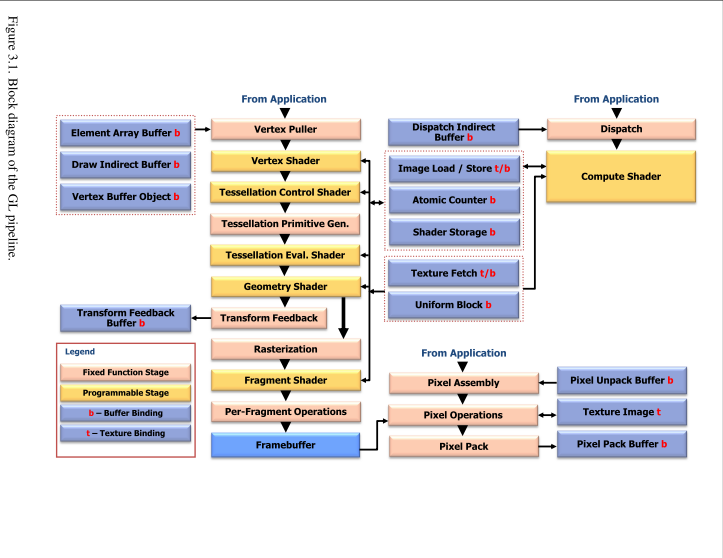

# Dataflow Model 

 Below shows a block diagram of the GL. Some commands specify geometric objects to be drawn while others specify state controlling how objects are handled by the various stages, or specify data contained in textures and buffer objects.

 
